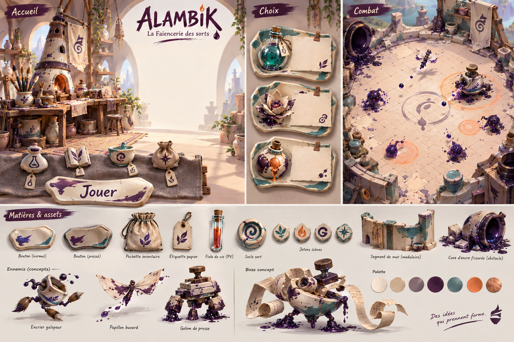

> Archive au 18 septembre 2026 : ce document décrit une proposition ou un plan
> ancien. Il ne constitue plus une instruction de réalisation, de test ou de
> build. L'état actif est dans `docs/CURRENT.md` ; le processus applicable est
> celui d'`AGENTS.md`. Les chemins cités dans le texte reflètent l'époque.

# Proposition — La Faïencerie des sorts

14 septembre 2026. Proposition artistique à discuter, non intégrée au jeu.

Planche originale générée avec ImageGen pour cette proposition. Elle montre l'intention de matières, des compositions et des pistes d'assets ; ses détails fins seront simplifiés pour le mobile. L'espace central de l'accueil est réservé au héros existant, volontairement absent de l'illustration.

## Intention

**Un apprenti traverse les ateliers d'une manufacture où les formules ont pris vie.** Les récipients marchent, les encres s'échappent et les fours fabriquent des créatures imparfaites. Le merveilleux vient de ces accidents de fabrication.

Le personnage principal actuel est le point d'ancrage : modèle, silhouette, costume et animations conservés. Son violet, son turquoise et ses touches cuivre se retrouvent dans le monde. Toute la présentation autour de lui entre dans la refonte : interface, décors, ennemis, boss, objets, effets, transitions, identité graphique et sonore. Les changements proposés sont visuels ; ils ne supposent pas de nouvelles mécaniques.

## Pourquoi changer la structure visuelle

Le code actuel centralise de nombreux panneaux et boutons dans `StyleAzur.cadre` et `StyleAzur.bouton`. `CadresAtelier.creer` produit déjà une texture à neuf tranches, mais à partir de rectangles SVG et de gravures partagés. Les profils de décors distinguent notamment les mondes par leurs couleurs et quelques motifs.

Il faut donner aux éléments des silhouettes, des matières et des usages reconnaissables : un rangement, un choix de formule et un départ en expédition doivent avoir leur propre visage. Le code continuera à gérer la disposition et les interactions ; des assets dessinés apporteront leur caractère.

Le document historique `human/11_DIRECTION_ARTISTIQUE.txt` décrit encore du pixel art, alors que l'état courant utilise un héros et des salles 3D. Cette proposition suit le héros 3D actuel et propose une nouvelle direction ; elle ne remplace pas silencieusement cette ancienne source.

## Grammaire commune

- **Trois matières dominantes :** faïence émaillée, verre soufflé, papier absorbant. Le tissu et les agrafes cuivre servent d'attaches secondaires.
- **Trois signes de famille :** bec verseur décentré, marque d'encre à trois gouttes, réparation par agrafe. Un ou deux signes suffisent sur un asset.
- **Formes :** volumes compacts, bords souples, asymétrie contrôlée. Les détails se concentrent sur les contours ; les surfaces portant du texte restent calmes.
- **Rendu :** 3D stylisée avec textures peintes, volumes doux et ombres colorées. Illustrations 2D d'interface traitées comme des objets issus du même atelier.
- **Palette :** craie `#F3E8D2`, prune `#40304F`, turquoise `#318C88`, terre cuite `#C87550`, cuivre `#AE855B`. Ce sont des références artistiques, pas encore des couleurs d'accessibilité validées.
- **Typographie :** lettrage spécifique pour le logo et quelques titres ; DM Sans conservée pour les descriptions et les nombres, à vérifier sur téléphone.

La singularité repose sur les objets inventés et leurs proportions. Éviter la surcharge de dorures, les engrenages ajoutés partout et les craquelures minuscules sur toutes les surfaces.

## Écrans et interactions

| Surface | Proposition | Assets nécessaires |
|---|---|---|
| Accueil | Établi ouvert sur la manufacture ; le héros existant occupe le centre. Départ sur une grande plaque émaillée. | Fond en plans séparés, rebord d'établi, plaque Jouer, jetons de navigation, enseigne |
| Équipement et Forge | Trousse dépliée et plateau de travail ; bijoux dans des logements de tissu, armes sur leurs supports. | Trousse, emplacements vides, supports, illustrations individuelles des objets, sceaux d'état |
| Maîtrises | Échantillons de céramique liés par un trait d'encre ; progression lisible dans chaque branche. | Supports de nœuds, liens, médaillons et variantes verrouillée/acquise |
| Sorts | Catalogue de spécimens, avec un dessin fort et une fiche claire par sort. | Fiches extensibles, illustrations, attaches, marqueurs d'équipement |
| Choix d'amélioration | Trois fiches superposées sur des coupelles, avec titre, effet et illustration immédiatement comparables. | Coupelle/fond extensible, coins et pinces séparés, illustrations d'améliorations |
| Alambic | Appareil expressif avec chambres de verre ; choix à proximité et lecture dégagée. | Corps de machine, liquide séparé, bulles, poignées et boutons |
| HUD | Tube de vitalité compact, progression en trait d'encre, commande de sort dans une douille émaillée. | Embouts, remplissages, socle de sort, états prêt/recharge, compteurs, pause |
| Réglages et pause | Ardoise d'atelier calme ; boutons en céramique et curseurs à bouchon. | Panneau sobre, interrupteurs, curseur, flèches, retour/fermeture |
| Bilan et récompenses | Bordereau d'expédition tamponné, objets rapportés disposés au-dessus. | Feuille extensible, tampons, supports de butin, illustrations de ressources |
| Campagne, Mine et Épreuves | Itinéraire d'étiquettes suspendues ; chaque mode possède une entrée et un emblème distincts. | Vignettes de mondes, attaches, emblèmes, portes et états de sélection |

La décoration ne devient pas une énigme : les actions importantes gardent un libellé visible et des zones tactiles régulières, même si leur contour illustré est irrégulier. Prévoir normal, appuyé, sélectionné, désactivé et focus ; la couleur seule n'indique pas l'état. Le HUD laisse la priorité à l'arène.

## Monde, bestiaire et effets

Chaque monde reçoit une architecture, une matière secondaire et des silhouettes propres. Les noms et l'ordre actuels restent les repères de campagne.

| Monde | Interprétation proposée |
|---|---|
| Encres | Cuves renversées, rigoles de pigment et séchoirs à feuilles ; encriers sur pattes et buvards ailés |
| Braises | Fours ventrus, briques rosées et émaux en cuisson ; creusets bondissants et soufflets vivants |
| Givre | Condenseurs givrés et verre laiteux ; gouttes cristallisées suspendues à des bouchons |
| Orages | Porcelaines isolantes et fils tendus ; bobines et carillons chargés |
| Venins | Bocaux de fermentation et membranes végétales ; graines en ampoule et flacons gonflés |
| Échos | Pavillons acoustiques en terre et galeries de résonateurs ; bols chantants emboîtés |
| Ombres | Lanternes éteintes et écrans de papier ; silhouettes décollées de leurs supports |
| Runes | Moules, presses et tampons monumentaux ; signes moulés assemblés en créatures |
| Néant | Étagères interrompues et poteries dont il manque des morceaux ; corps reliés autour d'un vide |
| Alambic | Grande manufacture où les matières convergent ; machines de distillation monumentales |

Pour Encres, premier ensemble à développer : un encrier coureur à bec latéral, un buvard volant plié en aile et une presse lourde au tampon décalé. Ce sont des pistes de silhouettes à associer aux rôles d'ennemis existants. Le boss reste identifiable comme l'Archiscribe, réinterprété en machine d'écriture vivante, avec masse principale et membres d'attaque clairement séparés.

Le sol de combat reste peu contrasté ; accessoires et richesse architecturale se concentrent aux bords. Les obstacles ont une base pleine et une emprise visible correspondant aux collisions. Les grandes silhouettes des boss ne masquent pas leurs annonces.

Les tirs et impacts utilisent des gouttes tendues, éclats d'émail et traits de pigment. Différencier alliés, ennemis et zones de danger par forme, bord et mouvement autant que par couleur. Une touche de magie violette relie les effets du héros à son identité, sans modifier le personnage. Les transitions peuvent faire couler un mince trait d'encre sur une étiquette ; éviter de recouvrir longtemps l'écran.

## Assets à fabriquer et livraison

Une planche conceptuelle sert à choisir les formes et les matières. Elle ne constitue pas un atlas prêt à découper ni une capture du jeu.

**Premier kit de validation :** un fond d'accueil en couches, une plaque Jouer avec ses états, quatre jetons de navigation, une famille de fiches de choix extensibles, un set HUD, six icônes représentatives, un kit de salle Encres avec sol/murs/porte/trois obstacles, trois ennemis et un concept de boss. Ce périmètre permet de juger une chaîne complète accueil → combat → amélioration → bilan avant de produire les dix mondes.

**Extension :** décliner ensuite tous les écrans du tableau, les objets et sorts des catalogues actifs, les ennemis/miniboss/boss des dix mondes, les modes annexes et les effets. Inventorier les entrées actives avant de chiffrer le volume : une simple recoloration de quelques modèles ne suffit pas à cette refonte.

Livrables de production :

- UI : PNG ou WebP avec alpha, bordures à neuf tranches et ornements séparés, remplissages animables, pictogrammes séparés. Textes et chiffres restent natifs Godot. Les sources conservent les couches.
- 3D : fichiers Blender et exports GLB, matériaux partagés, origines et échelles cohérentes, animations adaptées aux comportements existants. Chaque modèle possède un aperçu sous la caméra de combat.
- Effets : textures et séquences séparées du décor, variantes réduites, enveloppe visuelle bornée autour des impacts et annonces.
- Audio : essais originaux de tintements de céramique, frottements de papier, petits bouchons et souffles de verre ; signaux de dégâts et de danger plus francs. Reprendre aussi l'habillage musical autour de ce vocabulaire, après écoute des compositions présentes.
- Identité : logo dessiné, écrans de chargement et cadre d'icône renouvelés ; toute présence du héros réemploie sa représentation approuvée.

## Ordre de réalisation et validation

1. Valider la grammaire et les silhouettes sur la planche ; comparer ensuite un objet et un ennemi rendus à côté du véritable héros.
2. Produire le premier kit et l'intégrer à un parcours représentatif. Vérifier les textes longs, les états, les zones tactiles et les formats portrait.
3. Vérifier la lisibilité en mouvement et le coût du rendu sur Android : transparences limitées, textures mutualisées, budget géométrique mesuré sur les scènes réelles.
4. Étendre aux autres écrans puis aux mondes, en donnant à chaque famille une silhouette originale.
5. Exécuter `./verifier.sh` et `./sondes/vingt_runs.sh` après les modifications de code ou données, et lire le détail des résultats. Toute vérification automatisée reste sans fenêtre visible.

Critère décisif : à petite taille et sans lire son nom, on reconnaît un objet, un ennemi ou un menu comme appartenant à Alambik. L'illustration donne une personnalité au jeu tout en laissant les décisions et le combat immédiatement lisibles.

