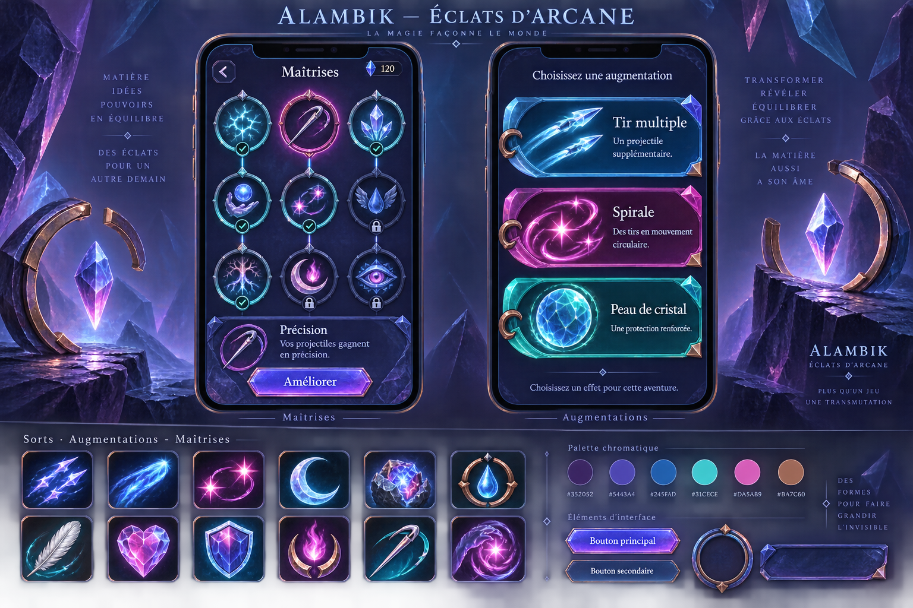

# Éclats d'arcane — proposition d'interface

Proposition du 14 septembre 2026, validée pour un essai et déclinée dans les menus. État d'intégration : `docs/ops/ECLATS_ARCANE.md`.

Illustration originale générée avec ImageGen. Les slogans et textes de présentation de la planche sont exploratoires ; ils ne constituent pas des textes joueur à reprendre. Le contraste et la densité des effets seront à ajuster sur les assets séparés.

## Périmètre demandé

Menus, maîtrises, choix d'augmentations, icônes d'augmentations, de maîtrises et de sorts. Le combat et les ennemis seront étudiés plus tard. Le modèle du personnage principal reste inchangé en combat. Lors de la validation, le propriétaire a demandé de remplacer son affichage 3D à l'accueil par une illustration embellie, proche du modèle existant.

La proposition précédente « La Faïencerie des sorts » a été rejetée : trop centrée sur l'encre et l'alchimie. Cette nouvelle piste équilibre magie et transformation de matière. Le propriétaire demande également de supprimer la présence dominante du beige et des couleurs aussi neutres.

## Direction proposée

Grandes surfaces prune, indigo et bleu ; verre magique coloré, reliefs minéraux et petites attaches cuivre. Turquoise et framboise ponctuent les sélections et les illustrations. Aucun fond de parchemin, de céramique crème ou d'atelier beige.

| Usage | Référence de couleur |
|---|---|
| Fond prune | `#352052` |
| Surfaces violet-bleu | `#5443A4` |
| Surfaces saphir | `#245FAD` |
| Accent turquoise | `#31CECE` |
| Accent framboise | `#DA5AB9` |
| Petites attaches cuivre | `#BA7C60` |

Palette conceptuelle : contraste des textes et des états à mesurer lors de l'intégration. Les halos restent localisés ; les descriptions reposent sur des surfaces calmes. Les couleurs neutres éventuelles se limitent aux petits détails et aux caractères lisibles.

## Écrans montrés

- **Maîtrises :** trois branches espacées, médaillons illustrés, liens fins, états acquis/sélectionné/verrouillé distincts par le cadre et un signe explicite. Une zone de détail et une action principale claire.
- **Choix d'augmentations :** trois cartes horizontales superposées, chacune avec une grande illustration, un titre et une courte description. Verre coloré et coins sculptés donnent une personnalité au cadre.
- **Bibliothèque d'icônes :** douze explorations de silhouettes mêlant phénomènes magiques, objets enchantés et matière transformée. Éviter une collection dominée par les fioles ou des glyphes abstraits interchangeables.

Les intitulés, descriptions et effets représentés dans la maquette sont illustratifs. Toute intégration réutilisera les catalogues actifs et les valeurs de jeu existantes.

## Assets envisagés

Cadres extensibles avec ornements séparés ; boutons et médaillons avec variantes d'état ; liens de progression ; illustrations individuelles sur fond transparent ; socles d'icônes adaptés à leur famille. Un coin facetté, un anneau ouvert et une petite attache cuivre constituent les motifs communs, utilisés avec parcimonie.

La magie s'exprime par les trajectoires, étoiles, flammes et apparitions. L'alchimie s'exprime par les cristallisations, gouttes, métaux et transformations. Les icônes privilégient une silhouette principale et des volumes simples, à contrôler à leur taille réelle sur téléphone.

Une planche générée sert à discuter la direction ; elle n'est ni une capture Godot ni un atlas prêt à intégrer. Textes, chiffres et interactions resteront natifs. La production des assets séparés dépend du choix de direction.
